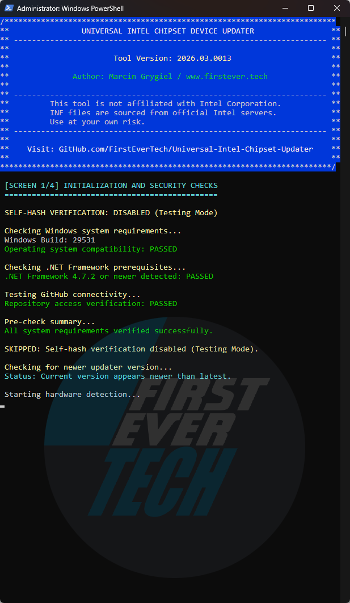
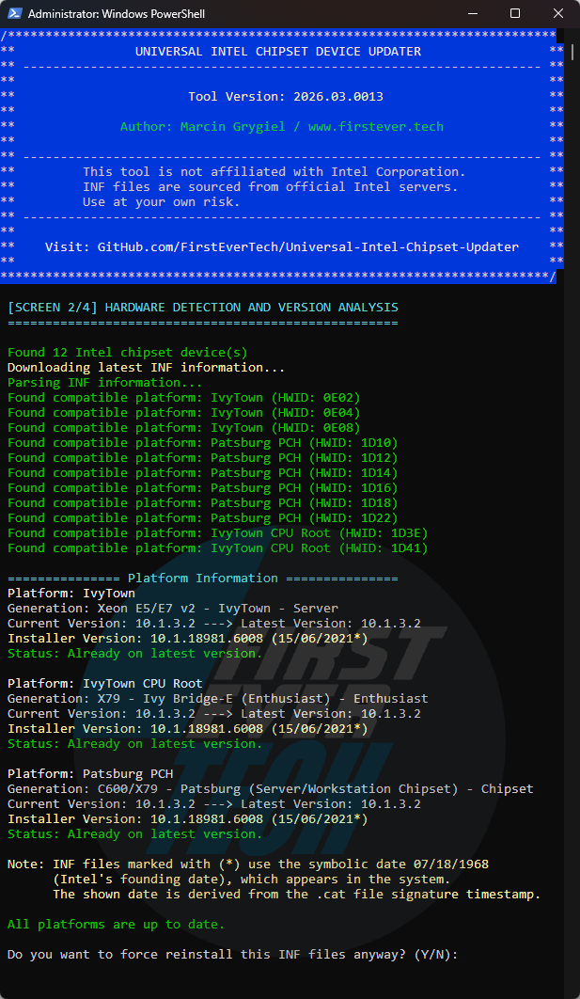
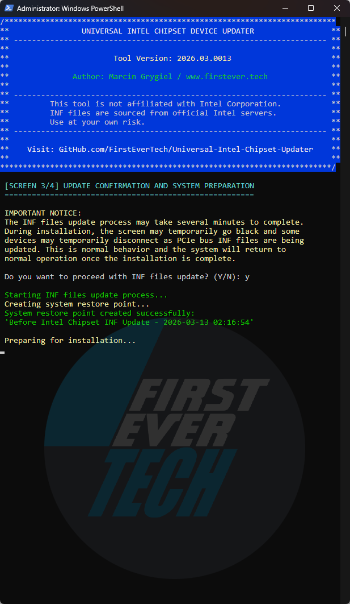
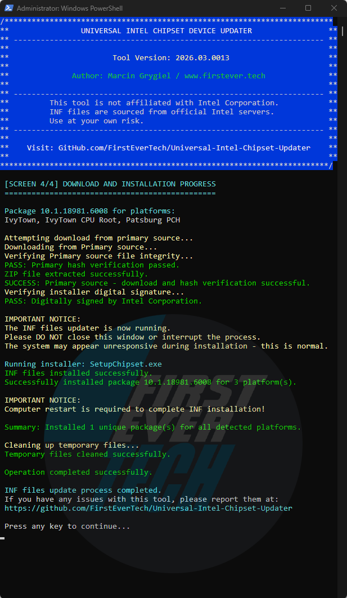

<a id="top"></a>
# 🚀 **Universal Intel Chipset Device Updater**

[](https://github.com/FirstEverTech/Universal-Intel-Chipset-Updater/releases)
[](LICENSE)
[](https://www.microsoft.com/windows)
[](https://learn.microsoft.com/en-us/powershell/scripting/install/install-powershell-on-windows?view=powershell-7.5)

[](https://github.com/FirstEverTech/Universal-Intel-Chipset-Updater/blob/main/SECURITY-AUDITS.md)
[](https://github.com/FirstEverTech/Universal-Intel-Chipset-Updater/blob/main/SECURITY-AUDITS.md)
[](https://github.com/FirstEverTech/Universal-Intel-Chipset-Updater/issues)
[](https://www.virustotal.com/gui/url/4aff9d07464a6e85bb604ffba6e81a589c8df38eeb9d1a70ffbaac890805069c?nocache=1)

## 🔧 Automate Your Intel Chipset Updates

**Universal Intel Chipset Device Updater** is an advanced, security-focused tool that automatically detects your Intel hardware and installs the latest official chipset **INF files** with enterprise-grade safety measures.

This project was built through a pragmatic collaboration between human expertise and AI-assisted tooling.  
Official discussion threads are available on the **[Win-Raid Forum](https://winraid.level1techs.com/t/tool-universal-intel-chipset-device-updater)** and **[Station-Drivers Forum](https://www.station-drivers.com/index.php/en/forum/intel-chipsets-drivers/887-universal-intel-chipset-drivers-updater)**.

For a detailed technical breakdown and historical context, see:  
→ **[The Whole Truth About Intel Chipset Device Software](https://github.com/FirstEverTech/Universal-Intel-Chipset-Updater/blob/main/docs/THE-WHOLE-TRUTH-ABOUT_EN_2026.md)**

---

<a id="table_of_contents"></a>
## 📑 **1. Table of Contents**

1. [**Table of Contents**](#table_of_contents)  
2. [**Release Highlights**](#release-highlights)  
   2.1 [Latest Version](#latest-version)  
   2.2 [Previous Releases](#previous-releases)  
3. [**Independent Security Audits**](#independent-security-audits)  
4. [**Application Overview**](#application-overview)  
5. [**Key Features**](#key-features)  
   5.1 [Smart Hardware Detection](#smart-hardware-detection)  
   5.2 [Multi-Layer Security](#multi-layer-security)  
   5.3 [Seamless Operation](#seamless-operation)  
   5.4 [Comprehensive Coverage](#comprehensive-coverage)  
6. [**System Requirements**](#system-requirements)  
   6.1 [System Requirements Table](#system-requirements-table)  
   6.2 [Windows Version Support](#windows-version-support)  
   6.3 [Legacy System Notes](#legacy-system-notes)  
7. [**Quick Comparison**](#quick-comparison)  
8. [**Quick Start**](#quick-start)  
   8.1 [Method 1: One-Click Execution](#method-1-one-click-execution)  
   8.2 [Method 2: PowerShell Direct](#method-2-powershell-direct)  
   8.3 [Method 3: Hardware ID Scanner Only](#method-3-hardware-id-scanner-only)  
9. [**How It Works**](#how-it-works)  
   9.1 [Self-Verification & Update Check](#self-verification-update-check)  
   9.2 [Hardware Detection](#hardware-detection)  
   9.3 [Database Query & Matching](#database-query-matching)  
   9.4 [Security Verification](#security-verification)  
   9.5 [Installation & Cleanup](#installation-cleanup)  
10. [**Security First Approach**](#security-first-approach)  
   10.1 [Verified Security Layers](#verified-security-layers)  
11. [**Usage Scenarios**](#usage-scenarios)  
   11.1 [Home Users](#home-users)  
   11.2 [IT Professionals & Technicians](#it-professionals-technicians)  
   11.3 [System Builders](#system-builders)  
12. [**Download Options**](#download-options)  
   12.1 [Option 1: SFX Executable (Recommended)](#option-1-sfx-executable-recommended)  
   12.2 [Option 2: Script Bundle](#option-2-script-bundle)  
   12.3 [Option 3: Source Code](#option-3-source-code)  
13. [**Independent Audit Results**](#independent-audit-results)  
14. [**Project Structure**](#project-structure)  
15. [**Release Structure**](#release-structure)  
   15.1 [Primary Files](#primary-files)  
   15.2 [Verification Files](#verification-files)  
   15.3 [Documentation](#documentation)  
16. [**Frequently Asked Questions (FAQ)**](#frequently-asked-questions-faq)  
   16.1 [Is this tool safe to use?](#is-this-tool-safe-to-use)  
   16.2 [Will this update all my Intel drivers?](#will-this-update-all-my-intel-drivers)  
   16.3 [What are the risks?](#what-are-the-risks)  
   16.4 [Where are files downloaded?](#where-are-files-downloaded)  
   16.5 [What if something goes wrong?](#what-if-something-goes-wrong)  
   16.6 [How does the automatic update check work?](#how-does-the-automatic-update-check-work)  
   16.7 [What does self-hash verification do?](#what-does-self-hash-verification-do)  
   16.8 [How are updates notified?](#how-are-updates-notified)  
   16.9 [Why is the certificate "not trusted"?](#why-is-the-certificate-not-trusted)  
17. [**Intel Platform Support**](#intel-platform-support)  
18. [**Performance Metrics**](#performance-metrics)  
   18.1 [Typical Execution Time Breakdown (Updated)](#typical-execution-times)  
   18.2 [Disk Space Usage](#disk-space-usage)  
   18.3 [Memory (RAM) Usage](#memory-ram-usage)  
   18.4 [Resource Usage Summary](#resource-usage-summary)  
19. [**Known Issues**](#known-issues)  
20. [**Ready to Update?**](#ready-to-update)  
   20.1 [Quick Start Guide](#quick-start-guide)  
   20.2 [Verification Steps (Optional)](#verification-steps-optional)  
   20.3 [Need Help?](#need-help)
21. [**Contributing**](#contributing)  
22. [**License**](#license)  
23. [**Acknowledgments**](#acknowledgments)  
24. [**Important Links**](#important-links)  
25. [**Author & Contact**](#author-and-contact)  
26. [**Support This Project**](#support-this-project)  


[↑ Back to top](#top)

---

<a id="release-highlights"></a>
## 🎉 **2. Release Highlights**

<a id="latest-version"></a>
### 2.1 Latest Version

**Universal Intel Chipset Device Updater v10.1-2026.02.2** → [Release Notes](https://github.com/FirstEverTech/Universal-Intel-Chipset-Updater/releases/tag/v10.1-2026.02.2)

## 📦 Latest Release: v10.1-2026.02.2

### 🆕 **Highlights**
- **Enhanced Pre-Launch Checks**:
  - Windows build validation (**Win10 LTSC 2019 / build 17763+**) now in PowerShell script
  - .NET 4.7.2+ detection moved to PowerShell
  - GitHub connectivity & TLS 1.2 check in PowerShell
  - User can continue despite warnings
- **Simplified BAT Launcher**:
  - BAT file now only handles elevation and launching PowerShell
  - Pre-checks moved to PowerShell for better reliability
  - Cleaner exit handling
- **Critical Fixes**:
  - Hash verification on older Windows fixed
  - Improved BAT reliability (working directory, elevation, clean exit)
  - Fixed exit code 100 handling for new version launches

### 🔧 **Technical Updates**
- **BAT launcher**: Simplified to only handle elevation and launch PowerShell script
- **PowerShell script**: 
  - Added comprehensive pre-checks (Windows build, .NET, GitHub connectivity)
  - Improved user guidance for older systems
  - Enhanced error handling and logging

### 🐛 **Bug Fixes**
- Fixed hash verification failures on older Windows 10 LTSB/LTSC builds
- Fixed pre-check warnings not clearly informing users about TLS/.NET requirements
- Fixed working directory issues in BAT launcher
- Fixed exit handling when auto-update triggers launch of new version

### 📋 **Included Files**
- `universal-intel-chipset-updater.ps1` – Main updater script (with enhanced pre-checks)
- `universal-intel-chipset-updater.bat` – Simplified launcher
- `ChipsetUpdater-10.1-2026.02.2-Win10-Win11.exe` – Self-extracting package

### ⚡ **Requirements & Notes**
- **Minimum Requirements**:
  - Windows 10 LTSC 2019 (build 17763) or newer
  - .NET Framework 4.7.2+
- Older LTSB/LTSC builds may run but GitHub hash verification could fail
- Intel INF package updates remain manual; community reports highly encouraged

---

**Summary**:
v10.1-2026.02.2 moves **pre-launch checks to PowerShell** for better reliability, simplifies the **BAT launcher**, improves **Windows compatibility** for older builds, and strengthens **user guidance** for systems with limited connectivity, while maintaining all hardware-accurate platform detection and INF installation features from previous releases.

---

### 🔍 **Technical Deep Dive: Installation Order Fix**

**Problem**: When Intel removes specific HWIDs from newer installer packages, but your hardware still needs those drivers:
- Example: Package v1.0 has HWID1, HWID2, HWID3
- Package v1.1 only has HWID2, HWID3 (Intel deprecated HWID1)
- Installing v1.1 first, then v1.0 would **downgrade** HWID2 and HWID3

**Solution**: Sort packages by version (oldest → newest) before installation:
1. v1.0 installs first → HWID1, HWID2, HWID3 all installed
2. v1.1 installs second → HWID2 and HWID3 **upgraded**, HWID1 unchanged
3. Result: All drivers at their **maximum available version**, no downgrades

**Code Change** (line 1716 in PowerShell script):
```powershell
# OLD CODE:
$sortedPackages = $packageGroups.Keys | Sort-Object { [version]($_ -replace '\s*\(S\)\s*', '') } -Descending

# NEW CODE (removed -Descending to sort oldest → newest):
$sortedPackages = $packageGroups.Keys | Sort-Object { [version]($_ -replace '\s*\(S\)\s*', '') }
```

This ensures legacy platforms receive optimal driver coverage without sacrificing newer updates for actively supported HWIDs.


---

### 🔍 **Technical Deep Dive: Installation Order Fix**

**Problem**: When Intel removes specific HWIDs from newer installer packages, but your hardware still needs those drivers:
- Example: Package v1.0 has HWID1, HWID2, HWID3
- Package v1.1 only has HWID2, HWID3 (Intel deprecated HWID1)
- Installing v1.1 first, then v1.0 would **downgrade** HWID2 and HWID3

**Solution**: Sort packages by version (oldest → newest) before installation:
1. v1.0 installs first → HWID1, HWID2, HWID3 all installed
2. v1.1 installs second → HWID2 and HWID3 **upgraded**, HWID1 unchanged
3. Result: All drivers at their **maximum available version**, no downgrades

**Code Change** (line ~1714 in PowerShell script):
```powershell
# Sort packages by version (oldest first) to prevent downgrade when installing missing HWIDs
$sortedPackages = $uniquePackages.GetEnumerator() | Sort-Object {
    $versionString = $_.Key -replace '-.*$', ''
    try { [version]$versionString } catch { $versionString }
}

foreach ($entry in $sortedPackages) {
    # Installation logic...
}
```

This ensures legacy platforms receive optimal driver coverage without sacrificing newer updates for actively supported HWIDs.


[↑ Back to top](#top)

<a id="previous-releases"></a>
### 2.2 Previous Releases

- v10.1-2026.02.1  → [Release Notes](https://github.com/FirstEverTech/Universal-Intel-Chipset-Updater/releases/tag/v10.1-2026.02.1)
- v10.1-2025.11.8  → [Release Notes](https://github.com/FirstEverTech/Universal-Intel-Chipset-Updater/releases/tag/v10.1-2025.11.8)
- v10.1-2025.11.7  → [Release Notes](https://github.com/FirstEverTech/Universal-Intel-Chipset-Updater/releases/tag/v10.1-2025.11.7)
- v10.1-2025.11.6  → [Release Notes](https://github.com/FirstEverTech/Universal-Intel-Chipset-Updater/releases/tag/v10.1-2025.11.6)
- v10.1-2025.11.5  → [Release Notes](https://github.com/FirstEverTech/Universal-Intel-Chipset-Updater/releases/tag/v10.1-2025.11.5)
- v10.1-2025.11.0  → [Release Notes](https://github.com/FirstEverTech/Universal-Intel-Chipset-Updater/releases/tag/v10.1-2025.11.0)


[↑ Back to top](#top)

<a id="independent-security-audits"></a>
## 🔍 **3. Independent Security Audits**

This project has undergone comprehensive analysis by multiple AI security experts to ensure code quality and reliability. The tool achieved an **average security score of 9.4/10** across all independent assessments.

| Auditor | Score | Key Assessment |
|---------|-------|----------------|
| **[Grok](https://github.com/FirstEverTech/Universal-Intel-Chipset-Updater/blob/main/docs/audit-reports/2026-02-01-GROK-AUDIT.md)** | 9.8/10 | *"This is currently the highest score I have ever given to a community driver-related utility."* |
| **[ChatGPT](https://github.com/FirstEverTech/Universal-Intel-Chipset-Updater/blob/main/docs/audit-reports/2026-02-01-CHATGPT-AUDIT.md)** | 9.6/10 | *"It does not behave like a hobby script, but like a carefully scoped system utility."* |
| **[Gemini](https://github.com/FirstEverTech/Universal-Intel-Chipset-Updater/blob/main/docs/audit-reports/2026-02-01-GEMINI-AUDIT.md)** | 9.5/10 | *"This tool is superior to many generic driver update solutions. It is safe, transparent, and highly efficient."* |
| **[Copilot](https://github.com/FirstEverTech/Universal-Intel-Chipset-Updater/blob/main/docs/audit-reports/2026-02-01-COPILOT-AUDIT.md)** | 9.4/10 | *"It is one of the most complete and technically impressive PowerShell-based hardware automation tools publicly available."* |
| **[DeepSeek](https://github.com/FirstEverTech/Universal-Intel-Chipset-Updater/blob/main/docs/audit-reports/2026-02-01-DEEPSEEK-AUDIT.md)** | 9.2/10 | *"The Universal Intel Chipset Device Updater represents a remarkable achievement in independent software development."* |
| **[Claude](https://github.com/FirstEverTech/Universal-Intel-Chipset-Updater/blob/main/docs/audit-reports/2026-02-01-CLAUDE-AUDIT.md)** | 8.7/10 | *"Automating Intel chipset INF updates for enthusiast and IT users — this is the best open-source option available."* |

*For detailed audit reports and methodology, see [SECURITY-AUDITS.md](SECURITY-AUDITS.md).*


[↑ Back to top](#top)

<a id="application-overview"></a>
## 🖼️ **4. Application Overview**

| Phase 1 | Phase 2 | Phase 3 | Phase 4 |
|:---------------:|:--------------:|:-------------------:|:-------------------:|
|  |  |  |  |
| *Security check and update check* | *Hardware detection and version analysis* | *Creating a system restore point* | *Download, verify and install* |


[↑ Back to top](#top)

<a id="key-features"></a>
## ✨ **5. Key Features**
<a id="smart-hardware-detection"></a>
### 🔍 5.1 Smart Hardware Detection
- Automatically scans for Intel chipset components
- Identifies specific Hardware IDs (HWIDs)
- Supports chipsets from Sandy Bridge to latest generations
- Detects both Consumer and Server platforms
<a id="multi-layer-security"></a>
### 🛡 5.2 Multi-Layer Security
- **SHA-256 Hash Verification** for all downloads
- **Digital Signature Validation** (Intel Corporation certificates)
- **Automated System Restore Points** before installation
- **Dual-Source Download** with backup fallback
- **Administrator Privilege Enforcement**
<a id="seamless-operation"></a>
### ⚡ 5.3 Seamless Operation
- No installation required - fully portable
- Automatic version checking and updates
- Clean, intuitive user interface
- Detailed logging and debug mode
- Save to Downloads folder option
<a id="comprehensive-coverage"></a>
### 🔄 5.4 Comprehensive Coverage
- Mainstream Desktop/Mobile platforms
- Workstation/Enthusiast systems
- Xeon/Server platforms
- Atom/Low-Power devices


[↑ Back to top](#top)

<a id="system-requirements"></a>
## 📋 **6. System Requirements**

<a id="system-requirements-table"></a>
### 6.1 System Requirements Table
| Component | Minimum | Recommended | Notes |
|-----------|---------|-------------|-------|
| Windows Version | 10 1809 (17763) | 11 22H2+ | 1809 requires .NET 4.7.2+ |
| .NET Framework | 4.6.1 | 4.8+ | 4.7.2+ for TLS 1.2 on older Windows |
| PowerShell | 5.1 | 7.3+ | Windows PowerShell 5.1 included |
| Administrator | Required | Required | For driver installation |
| Internet | Required | Required | For hash verification and updates |
| RAM | 2 GB | 4 GB+ | For INF extraction/installation |
| Disk Space | 500 MB | 1 GB+ | Temporary files during installation |
| System Restore | Optional | Enabled | Automatic restore point creation |

<a id="windows-version-support"></a>
### 6.2 Windows Version Support
| Version | Build | Status | Notes |
|---------|-------|--------|-------|
| Windows 11 | All builds | ✅ Full | Optimized support |
| Windows 10 | 22H2+ | ✅ Full | Recommended |
| Windows 10 | 21H2 | ✅ Full | Stable |
| Windows 10 | 21H1 (19043) | ✅ Full | Legacy |
| Windows 10 | 20H2 (19042) | ✅ Full | Legacy |
| Windows 10 | 2004 (19041) | ✅ Full | Legacy |
| Windows 10 | 1909 (18363) | ✅ Full | Legacy |
| Windows 10 | 1903 (18362) | ✅ Full | Legacy |
| Windows 10 | 1809 (17763) | ✅ Limited | Requires .NET 4.7.2+ for TLS 1.2 support |
| Windows 10 | LTSB 2016 (1607) | ⚠️ Limited | Manual updates required for TLS 1.2 |
| Windows 10 | LTSB 2015 (1507) | ⚠️ Limited | Manual updates required for TLS 1.2 |

<a id="legacy-system-notes"></a>
### 6.3 Legacy System Notes
- **Windows 10 1809 (17763) and newer**: Full TLS 1.2 support out-of-the-box
- **Windows 10 LTSB 2015/2016**: May require manual installation of:
  - [.NET Framework 4.8](https://go.microsoft.com/fwlink/?linkid=2088631)
  - [KB4474419](https://catalog.update.microsoft.com/Search.aspx?q=KB4474419) (SHA-2 update)
- **The tool automatically**: 
  - Detects Windows version limitations
  - Warns about potential connectivity issues
  - Provides fallback options for offline operation
- **Basic INF detection and installation** works even without internet connectivity


[↑ Back to top](#top)

<a id="quick-comparison"></a>
## ⚡ **7. Quick Comparison**

| Feature | This Tool | Intel DSA | Manual Installation |
|---------|-----------|-----------|---------------------|
| **Automatic Detection** | ✅ Full | ✅ Partial | ❌ Manual |
| **Security Verification** | ✅ Multi-layer | ✅ Basic | ❌ None |
| **System Restore Points** | ✅ Automatic | ❌ None | ❌ Manual |
| **Update Notifications** | ✅ Built-in | ✅ Yes | ❌ None |
| **Self-updating** | ✅ Yes | ❌ No | ❌ No |
| **Portable** | ✅ No install | ❌ Requires install | ✅/❌ Varies |
| **Free** | ✅ 100% | ✅ Yes | ✅ Yes |


[↑ Back to top](#top)

<a id="quick-start"></a>
## 🚦 **8. Quick Start**
<a id="method-1-one-click-execution"></a>
### 8.1 Method 1: One-Click Execution
```batch
# Download and run executable file as Administrator:
ChipsetUpdater-10.1-2025.11.7-Win10-Win11.exe (or later version)

# Optionaly, download .ps1 and .bat files, then run BATCH file as Administrator:
Universal-Intel-Chipset-Updater.bat

```
<a id="method-2-powershell-direct"></a>
### 8.2 Method 2: PowerShell Direct
```powershell
# Run PowerShell as Administrator, then:
.\Universal-Intel-Chipset-Updater.ps1
```
<a id="method-3-hardware-id-scanner-only"></a>
### 8.3 Method 3: Hardware ID Scanner Only
```batch
# For diagnostic purposes
Get-Intel-HWIDs.bat
```


[↑ Back to top](#top)

<a id="how-it-works"></a>
## 🔧 **9. How It Works**
<a id="self-verification-update-check"></a>
### 🔒 9.1 Self-Verification & Update Check
- **Integrity Verification** - Validates script hash against GitHub release
- **Update Detection** - Compares current version with latest available
- **Security First** - Ensures tool hasn't been modified or corrupted
<a id="hardware-detection"></a>
### 🔍 9.2 Hardware Detection
- Scans PCI devices for Intel Vendor ID (8086)
- Identifies chipset-related components
- Extracts Hardware IDs and current driver versions
<a id="database-query-matching"></a>
### 📊 9.3 Database Query & Matching
- Downloads latest INF database from GitHub
- Matches detected HWIDs with compatible packages
- Compares current vs latest versions
<a id="security-verification"></a>
### 🛡 9.4 Security Verification
- Creates system restore point automatically
- Downloads from primary/backup sources
- Verifies SHA-256 hashes
- Validates Intel digital signatures
<a id="installation-cleanup"></a>
### ⚡ 9.5 Installation & Cleanup
- Executes official Intel setup with safe parameters
- Provides real-time progress feedback
- Automatic cleanup of temporary files


[↑ Back to top](#top)

<a id="security-first-approach"></a>
## 🛡 **10. Security First Approach**
<a id="verified-security-layers"></a>
### 🔒 10.1 Verified Security Layers
```text
1. Self-Integrity → Script Hash Verification
2. File Integrity → SHA-256 Hash Verification  
3. Authenticity → Intel Digital Signatures
4. Project Origin → FirstEver.tech Digital Signature
5. System Safety → Automated Restore Points
6. Source Reliability → Dual Download Sources
7. Privilege Control → Admin Rights Enforcement
8. Update Safety → Version Verification
```


[↑ Back to top](#top)

<a id="usage-scenarios"></a>
## 🎯 **11. Usage Scenarios**
<a id="home-users"></a>
### 🏠 11.1 Home Users
- **Keep system updated** without technical knowledge
- **Automatic safety checks** prevent installation issues
- **One-click operation** with clear prompts
<a id="it-professionals-technicians"></a>
### 💼 11.2 IT Professionals & Technicians
- **Batch deployment** across multiple systems
- **Comprehensive logging** for troubleshooting
- **Security verification** for corporate environments
<a id="system-builders"></a>
### 🛠 11.3 System Builders
- **Pre-installation preparation** for new builds
- **Driver consistency** across multiple systems
- **Time-saving automation** vs manual updates


[↑ Back to top](#top)

<a id="download-options"></a>
## 📥 **12. Download Options**
<a id="option-1-sfx-executable-recommended"></a>
### 12.1 Option 1: SFX Executable (Recommended)
- **File**: `ChipsetUpdater-10.1-2025.11.6-Win10-Win11.exe`
- **Features**: Digital signature, one-click execution, automatic extraction
- **For**: Most users, easiest method
<a id="option-2-script-bundle"></a>
### 12.2 Option 2: Script Bundle
- **Files**: `universal-intel-chipset-updater.bat` + `universal-intel-chipset-updater.ps1`
- **Features**: Full control, modifiable code, transparency
- **For**: Advanced users, customization
<a id="option-3-source-code"></a>
### 12.3 Option 3: Source Code
- **Method**: `git clone` the repository
- **Features**: Latest development version, full customization
- **For**: Developers, contributors


[↑ Back to top](#top)

<a id="independent-audit-results"></a>
## 📊 **13. Independent Audit Results**

This project has been thoroughly audited by 6 independent AI security experts, achieving an average score of 9.4/10. Multiple auditors confirmed it's the safest and most stable version ever released, suitable for daily use, corporate deployment, and technician toolkits.

[View Full Audit Report](SECURITY-AUDITS.md) • [Security Policy](SECURITY.md)

For current limitations and workarounds, please see: [KNOWN_ISSUES.md](KNOWN_ISSUES.md)


[↑ Back to top](#top)

<a id="project-structure"></a>
## 📁 **14. Project Structure**

**Key Files and Directories:**

`src/` - Main scripts directory
- [universal-intel-chipset-updater.bat](src/universal-intel-chipset-updater.bat) - Main batch script
- [universal-intel-chipset-updater.ps1](src/universal-intel-chipset-updater.ps1) - Main PowerShell script  
- [get-intel-hwids.bat](src/get-intel-hwids.bat) - Hardware ID scanner batch script
- [get-intel-hwids.ps1](src/get-intel-hwids.ps1) - Hardware ID scanner PowerShell script

`data/` - Data files
- [intel-chipset-infs-latest.md](data/intel-chipset-infs-latest.md) - Latest INF database
- [intel-chipset-infs-download.txt](data/intel-chipset-infs-download.txt) - Download links

`docs/` - Documentation
- [BEHIND-THE-PROJECT_EN.md](docs/BEHIND-THE-PROJECT_EN.md) - Project background (English)
- [BEHIND-THE-PROJECT_PL.md](docs/BEHIND-THE-PROJECT_PL.md) - Project background (Polish)
  
- `audit-reports/` - Security audit reports

  - [2026-02-01-CHATGPT-AUDIT.md](docs/audit-reports/2026-02-01-CHATGPT-AUDIT.md)
  - [2026-02-01-CLAUDE-AUDIT.md](docs/audit-reports/2026-02-01-CLAUDE-AUDIT.md)
  - [2026-02-01-COPILOT-AUDIT.md](docs/audit-reports/2026-02-01-COPILOT-AUDIT.md)
  - [2026-02-01-DEEPSEEK-AUDIT.md](docs/audit-reports/2026-02-01-DEEPSEEK-AUDIT.md)
  - [2026-02-01-GEMINI-AUDIT.md](docs/audit-reports/2026-02-01-GEMINI-AUDIT.md)
  - [2026-02-01-GROK-AUDIT.md](docs/audit-reports/2026-02-01-GROK-AUDIT.md)
  - [2025-11-21-CHATGPT-AUDIT.md](docs/audit-reports/2025-11-21-CHATGPT-AUDIT.md)
  - [2025-11-21-CLAUDE-AUDIT.md](docs/audit-reports/2025-11-21-CLAUDE-AUDIT.md)
  - [2025-11-21-COPILOT-AUDIT.md](docs/audit-reports/2025-11-21-COPILOT-AUDIT.md)
  - [2025-11-21-DEEPSEEK-AUDIT.md](docs/audit-reports/2025-11-21-DEEPSEEK-AUDIT.md)
  - [2025-11-21-GEMINI-AUDIT.md](docs/audit-reports/2025-11-21-GEMINI-AUDIT.md)
  - [2025-11-21-GROK-AUDIT.md](docs/audit-reports/2025-11-21-GROK-AUDIT.md)

`assets/` - Screenshots

- [1-security.png](assets/1-security.png)
- [2-detection.png](assets/2-detection.png)
- [3-backup.png](assets/3-backup.png)
- [4-install.png](assets/4-install.png)

`ISSUE_TEMPLATE/` - Issue templates
- [bug_report.md](ISSUE_TEMPLATE/bug_report.md) - Bug report template
- [config.yml](ISSUE_TEMPLATE/config.yml) - Issue templates configuration file

`/` - Root directory files
- [CHANGELOG.md](CHANGELOG.md) - Project changelog
- [CONTRIBUTING.md](CONTRIBUTING.md) - Contribution guidelines
- [KNOWN_ISSUES.md](KNOWN_ISSUES.md) - Known issues and workarounds
- [LICENSE](LICENSE) - MIT License
- [PULL_REQUEST_TEMPLATE.md](PULL_REQUEST_TEMPLATE.md) - Pull request template
- [README.md](README.md) - Main project documentation
- [SECURITY.md](SECURITY.md) - Security policy
- [SECURITY-AUDITS.md](SECURITY-AUDITS.md) - Comprehensive security audits summary


[↑ Back to top](#top)

<a id="release-structure"></a>
## 📦 **15. Release Structure**

Each version (v10.1-2025.11.6) includes:
<a id="primary-files"></a>
### 15.1 Primary Files
- `ChipsetUpdater-10.1-2025.11.6-Win10-Win11.exe` - Main executable (digitally signed)
- `universal-intel-chipset-updater.bat` - Batch wrapper
- `universal-intel-chipset-updater.ps1` - PowerShell script
<a id="verification-files"></a>
### 15.2 Verification Files  
- `ChipsetUpdater-10.1-2025.11.6-Win10-Win11.sha256` - EXE hash
- `universal-intel-chipset-updater-10.1-2025.11.6-ps1.sha256` - PS1 script hash
- `FirstEver.tech.cer` - Digital certificate
<a id="documentation"></a>
### 15.3 Documentation
- `CHANGELOG.md` - Version history
- `SECURITY-AUDITS.md` - Security reports


[↑ Back to top](#top)

<a id="frequently-asked-questions-faq"></a>
## ❓ **16. Frequently Asked Questions (FAQ)**
<a id="is-this-tool-safe-to-use"></a>
### 🤔 16.1 Is this tool safe to use?
Yes! This tool has undergone comprehensive independent security audits by 6 different AI experts with an average score of 9.1/10. Multiple auditors confirmed it's the safest and most stable version ever released, suitable for daily use, corporate deployment, and technician toolkits.

Security measures include:

- Hash verification of all downloads
- Automatic system restore points before installation
- Official Intel drivers only from trusted sources
- Comprehensive pre-installation checks

**Version 10.1-2025.11.6** is strongly recommended by security auditors for optimal safety and performance.
<a id="will-this-update-all-my-intel-drivers"></a>
### 🔄 16.2 Will this update all my Intel drivers?
This tool specifically updates chipset INF files. It does not update GPU, network, or other device drivers.
<a id="what-are-the-risks"></a>
### ⚠️ 16.3 What are the risks?
As with any system modification, there's a small risk of temporary system instability. The automated restore point minimizes this risk significantly.
<a id="where-are-files-downloaded"></a>
### 💾 16.4 Where are files downloaded?
Files are temporarily stored in `C:\Windows\Temp\IntelChipset\` and automatically cleaned up after installation.
<a id="what-if-something-goes-wrong"></a>
### 🔧 16.5 What if something goes wrong?
The tool creates a system restore point before making changes. You can also check detailed logs in the temp directory.
<a id="how-does-the-automatic-update-check-work"></a>
### 🔄 16.6 How does the automatic update check work?
The tool compares your current version with the latest version on GitHub. If a newer version is available, it offers to download it directly to your Downloads folder with full verification.
<a id="what-does-self-hash-verification-do"></a>
### 🔒 16.7 What does self-hash verification do?
Before execution, the tool calculates its own SHA-256 hash and compares it with the official hash from GitHub. This ensures the file hasn't been modified, corrupted, or tampered with.
<a id="how-are-updates-notified"></a>
### 📧 16.8 How are updates notified?
The tool automatically checks for updates on each run and clearly notifies you if a newer version is available, with options to continue or update.
<a id="why-is-the-certificate-not-trusted"></a>
### 🏷️ 16.9 Why is the certificate "not trusted"?
The FirstEver.tech certificate is self-signed for project authenticity. Public trust requires expensive commercial certificates, but the included certificate allows verification of file origin.


[↑ Back to top](#top)

<a id="intel-platform-support"></a>
## 💻 **17. Intel Platform Support**

| Generation | Code Name | Status | Notes |
|------------|-----------|--------|-------|
| 12th-14th Gen | Alder/Raptor Lake | ✅ Full | Latest support |
| 10th-11th Gen | Comet/Tiger Lake | ✅ Full | Complete support |
| 8th-9th Gen | Coffee/Whiskey Lake | ✅ Full | Stable support |
| 6th-7th Gen | Skylake/Kaby Lake | ✅ Full | Mature support |
| 4th-5th Gen | Haswell/Broadwell | ✅ Full | Legacy support |
| 2nd-3rd Gen | Sandy/Ivy Bridge | ✅ Full | Extended support |


[↑ Back to top](#top)

<a id="performance-metrics"></a>
## 📊 **18. Performance Metrics**
<a id="typical-execution-times"></a>
### 18.1 Typical Execution Time Breakdown (Updated)
| **Phase** | **Time** | **Description** |
|----------|----------|-----------------|
| Compatibility Pre-Check | 5–10 seconds | OS build, .NET Framework, TLS 1.2 availability, administrator privileges and GitHub connectivity verification |
| Verification & Update Check | 5–10 seconds | Self-integrity hash verification and updater version check |
| Hardware Detection | 10–25 seconds | Full system scan and Intel chipset device identification (HWID enumeration) |
| System Restore Point Creation | 30–60 seconds | Automatic creation of a Windows System Restore Point before applying any changes |
| Package Download & Verification | 5–10 seconds | Download and integrity verification of required Intel INF metadata packages |
| Installation | 60–120 seconds | INF file installation, registry updates and device reconfiguration |
<a id="disk-space-usage"></a>
### 18.2 Disk Space Usage
| **Stage** | **Estimated Usage** | **Notes** |
|----------|---------------------|-----------|
| SFX archive (download) | ~0.7 MB | Self-extracting EXE |
| Extracted scripts (BAT + PS1) | ~90 KB | Temporary working files |
| System Restore Point | 100–300 MB | Managed by Windows (shadow copy storage) |
| Downloaded Intel package | 2–10 MB | EXE or MSI, platform-dependent |
| Extracted package contents | 10–30 MB | Temporary extraction of INF files |
| **Peak temporary disk usage** | **~150–350 MB** | During restore point creation and extraction |
| **Persistent disk usage after completion** | **< 5 MB** | Scripts and logs only |

**Important notes:**
- System Restore Point size is the dominant factor and depends on Windows configuration.
- All extracted installer files are automatically removed after completion.
- No drivers or binaries remain installed — only INF metadata.
<a id="memory-ram-usage"></a>
### 18.3 Memory (RAM) Usage
| **Component** | **Estimated Usage** | **Notes** |
|--------------|---------------------|-----------|
| BAT launcher | < 5 MB | cmd.exe overhead |
| PowerShell runtime | 40–80 MB | Script execution, parsing and hashing |
| INF parsing & HWID scan | 20–40 MB | Temporary in-memory data structures |
| Installer extraction (EXE/MSI) | 30–100 MB | Short peak during unpacking |
| **Peak RAM usage** | **~100–200 MB** | Worst-case during package extraction |

**Memory characteristics:**
- RAM usage is short-lived and released immediately after each phase.
- No background services or resident processes.
- Safe even for systems with 2 GB RAM.
<a id="resource-usage-summary"></a>
### 18.4 Resource Usage Summary
- **Required free disk space:** ~350 MB (safe upper bound)
- **Typical disk usage:** ~150–250 MB
- **Peak RAM usage:** ~100–200 MB
- **Persistent footprint after exit:** negligible


[↑ Back to top](#top)

<a id="known-issues"></a>
## 🐛 **19. Known Issues**

For current limitations and workarounds, please see: [KNOWN_ISSUES.md](KNOWN_ISSUES.md)


[↑ Back to top](#top)

<a id="ready-to-update"></a>
## 🚀 **20. Ready to Update?**
<a id="quick-start-guide"></a>
### 20.1 Quick Start Guide
1. **Download** latest release from [Releases page](https://github.com/FirstEverTech/Universal-Intel-Chipset-Updater/releases)
2. **Verify** digital signature and hashes (optional but recommended)
3. **Run as Administrator** for full system access  
4. **Follow prompts** - tool handles everything automatically
5. **Restart if prompted** to complete installation
<a id="verification-steps-optional"></a>
### 20.2 Verification Steps (Optional)
- Check file hashes match published SHA256 files
- Verify digital signature with included certificate
- Review security audit reports for confidence
<a id="need-help"></a>
### 20.3 Need Help?
- 📚 [Full Documentation](https://github.com/FirstEverTech/Universal-Intel-Chipset-Updater/tree/main/docs)
- 🐛 [Report Issues](https://github.com/FirstEverTech/Universal-Intel-Chipset-Updater/issues)
- 💬 [Community Discussions](https://github.com/FirstEverTech/Universal-Intel-Chipset-Updater/discussions)
- 🔧 [Troubleshooting Guide](KNOWN_ISSUES.md)
- 🔒 [Security Information](SECURITY-AUDITS.md)[↑ Back to top](#top)


[↑ Back to top](#top)

<a id="contributing"></a>
## 🤝 **21. Contributing**

We welcome contributions! Please feel free to submit pull requests, report bugs, or suggest new features.

**Areas for Contribution:**
- Additional hardware platform support
- Translation improvements
- Documentation enhancements
- Testing on various Windows versions


[↑ Back to top](#top)

<a id="license"></a>
## 📄 **22. License**

This project is licensed under the MIT License - see the [LICENSE](LICENSE) file for details.


[↑ Back to top](#top)

<a id="acknowledgments"></a>
## 🙏 **23. Acknowledgments**

- Intel Corporation for providing official driver packages
- Security researchers for independent audits
- Open source community for continuous improvement
- Beta testers for real-world validation


[↑ Back to top](#top)

<a id="important-links"></a>
## 🔗 **24. Important Links**

- [Releases](https://github.com/FirstEverTech/Universal-Intel-Chipset-Updater/releases) - Download latest version
- [Security Audits](SECURITY-AUDITS.md) - Full audit history  
- [Issue Tracker](https://github.com/FirstEverTech/Universal-Intel-Chipset-Updater/issues) - Report problems


[↑ Back to top](#top)

<a id="author-and-contact"></a>
## 🧑‍💻 **25. Author & Concatc**

**Marcin Grygiel** aka FirstEver
- 🌐 **Website**: [www.firstever.tech](https://www.firstever.tech)
- 💼 **LinkedIn**: [Marcin Grygiel](https://www.linkedin.com/in/marcin-grygiel/)
- 🔧 **GitHub**: [FirstEverTech](https://github.com/FirstEverTech)
- 📧 **Contact**: [Contact Form](https://www.firstever.tech/contact)


[↑ Back to top](#top)

<a id="support-this-project"></a>

## 💖 26. Support This Project
This project is maintained in my free time. Your support helps cover development costs and server expenses.

[](https://www.paypal.com/donate/?hosted_button_id=48VGDSCNJAPTJ)
[](https://buymeacoffee.com/firstevertech)
[](https://github.com/sponsors/FirstEverTech)

**Your support means everything!** If this project helped you, please consider:
- If this project helped you, please give it a ⭐ star on GitHub
- Sharing with friends and colleagues
- Reporting issues or suggesting features
- Supporting development financially

---
<div align="center">

</div>

---

**Note**: This tool is provided as-is for educational and convenience purposes. While we strive for accuracy, always verify critical INF updates through official channels. The complete HWID database is available for transparency and community contributions.

[↑ Back to top](#top)
