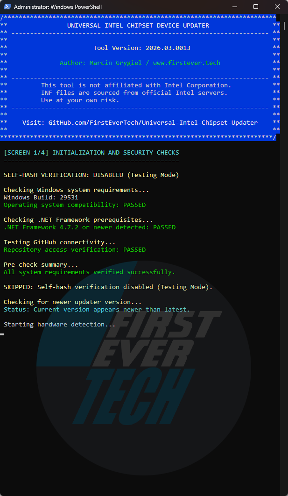
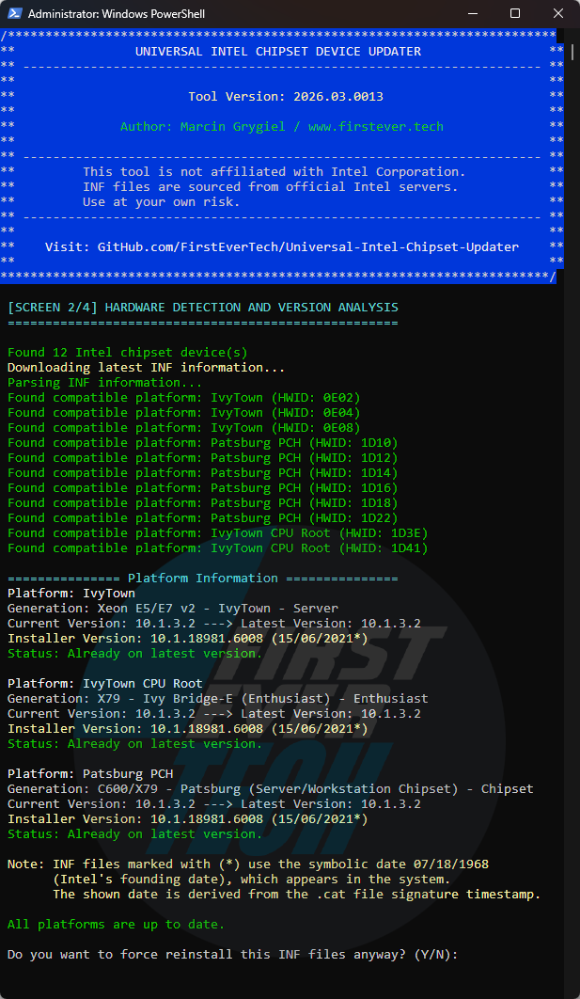
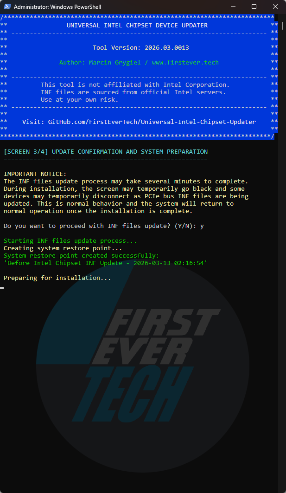
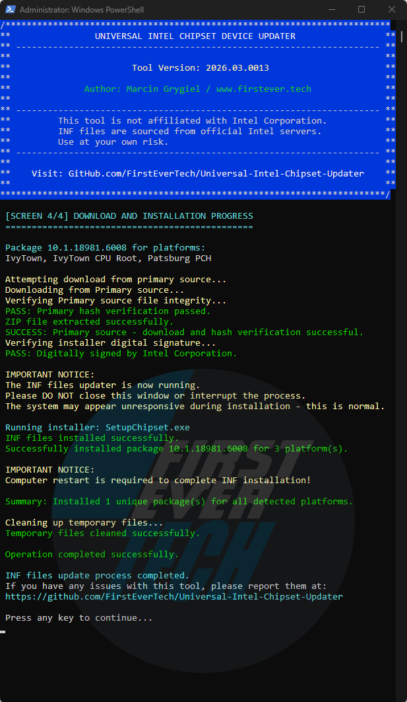

<a id="top"></a>
# 🚀 **Universal Intel Chipset Device Updater**

[](https://github.com/FirstEverTech/Universal-Intel-Chipset-Updater/releases)[](https://www.microsoft.com/windows)[](https://learn.microsoft.com/en-us/powershell/scripting/install/install-powershell-on-windows?view=powershell-7.5)[](https://dotnet.microsoft.com/en-us/download/dotnet-framework)

[](LICENSE)[](https://www.powershellgallery.com/packages/universal-intel-chipset-device-updater)[](https://github.com/FirstEverTech/Universal-Intel-Chipset-Updater/blob/main/AI_AUDITS.md)[](https://www.virustotal.com/gui/url/f903129a9443fd09d5d2448b0647c85274a111bc8844ceb5e70eed0e5a0a5604?nocache=1)[](https://github.com/FirstEverTech/Universal-Intel-Chipset-Updater/issues)

## 🔧 Automate Your Intel Chipset Updates
**Universal Intel Chipset Device Updater** is an advanced, security-focused tool that automatically detects your Intel hardware and installs the latest official chipset **INF files** with enterprise-grade safety measures.

This project was built through a pragmatic collaboration between human expertise and AI-assisted tooling.  

### Why This Tool Exists
Intel's official Chipset Device Software has evolved over 25 years into a complex, bloated package. This tool simplifies the process by automatically detecting and installing only the INF files your system actually needs — nothing more, nothing less.

For detailed documentation and guides, see:  
→ **[The Whole Truth About Intel Chipset Device Software](https://github.com/FirstEverTech/Universal-Intel-Chipset-Updater/blob/main/docs/THE-WHOLE-TRUTH-ABOUT_EN_2026.md)**  
→ **[Behind the Project: Making Of](https://github.com/FirstEverTech/Universal-Intel-Chipset-Updater/blob/main/docs/BEHIND-THE-PROJECT_EN_2025.md)**  
→ **[Deploying Universal Intel Chipset Device Updater via MDM](https://github.com/FirstEverTech/Universal-Intel-Chipset-Updater/blob/main/docs/MDM-DEPLOYMENT-GUIDE_EN_2026.md)**  
→ **[How to verify the latest INF files yourself](https://github.com/FirstEverTech/Universal-Intel-Chipset-Updater/blob/main/docs/HOW-TO-VERIFY-INF_EN_2026.md)**  

⭐ If this project helped you, please click the "Star" button at the top of this page on GitHub.

---

- Official threads on the following forums: **[TechPowerUp](https://www.techpowerup.com/forums/threads/tool-universal-intel-chipset-device-updater.346086/)**, **[Win-Raid](https://winraid.level1techs.com/t/tool-universal-intel-chipset-device-updater)**, **[Station-Drivers](https://www.station-drivers.com/index.php/en/forum/intel-chipsets-drivers/887-universal-intel-chipset-drivers-updater)**, **[ElevenForum](https://www.elevenforum.com/t/universal-intel-chipset-device-updater.41790)** and **[WinClub](https://winclub.pl/topic/49717-universal-intel-chipset-device-updater)**.
- For transparency and additional verification, the project has recently been listed on: **[MajorGeeks](https://www.majorgeeks.com/files/details/universal_intel_chipset_device_updater.html)** and **[Softpedia](https://www.softpedia.com/get/System/Universal-Intel-Chipset-Device-Updater.shtml)**.

---

## 💼 Career Opportunity

> [!TIP]
> **I'm currently seeking new challenges where I can apply my expertise in solving complex IT infrastructure problems. If your organization struggles with system compatibility, automation, or tooling gaps – let's discuss how I can help.**
>
> 🔗 **Connect with me:** [linkedin.com/in/marcin-grygiel](https://linkedin.com/in/marcin-grygiel)

---

<a id="table_of_contents"></a>
## 📑 **1. Table of Contents**

1. [**Table of Contents**](#table_of_contents)  
2. [**Release Highlights**](#release-highlights)  
   2.1 [Latest Version](#latest-version)  
   2.2 [Previous Release](#previous-releases)  
   2.3 [Older Releases](#older-releases)  
3. [**AI Audit_Reports**](#ai-audit-reports)  
4. [**Application Overview**](#application-overview)  
5. [**Key Features**](#key-features)  
   5.1 [Smart Hardware Detection](#smart-hardware-detection)  
   5.2 [Multi-Layer Security](#multi-layer-security)  
   5.3 [Seamless Operation](#seamless-operation)  
   5.4 [Comprehensive Coverage](#comprehensive-coverage)  
6. [**System Requirements**](#system-requirements)  
   6.1 [System Requirements Table](#system-requirements-table)  
   6.2 [Windows Version Support](#windows-version-support)  
   6.3 [Legacy System Notes](#legacy-system-notes)  
7. [**Quick Comparison**](#quick-comparison)  
8. [**Quick Start**](#quick-start)  
   8.1 [Method 1: One-Click Execution](#method-1-one-click-execution)  
   8.2 [Method 2: PowerShell Direct](#method-2-powershell-direct)  
   8.3 [Method 3: Hardware ID Scanner Only](#method-3-hardware-id-scanner-only)  
   8.4 [Method 4: PowerShell Gallery](#method-4-powershell-gallery)  
   8.5 [Command-Line Options](#command-line-options)  
9. [**How It Works**](#how-it-works)  
   9.1 [Self-Verification & Update Check](#self-verification-update-check)  
   9.2 [Hardware Detection](#hardware-detection)  
   9.3 [Database Query & Matching](#database-query-matching)  
   9.4 [Security Verification](#security-verification)  
   9.5 [Installation & Cleanup](#installation-cleanup)  
10. [**Security First Approach**](#security-first-approach)  
   10.1 [Verified Security Layers](#verified-security-layers)  
11. [**Usage Scenarios**](#usage-scenarios)  
   11.1 [Home Users](#home-users)  
   11.2 [IT Professionals & Technicians](#it-professionals-technicians)  
   11.3 [System Builders](#system-builders)  
12. [**Download Options**](#download-options)  
   12.1 [Option 1: SFX Executable (Recommended)](#option-1-sfx-executable-recommended)  
   12.2 [Option 2: Script Bundle](#option-2-script-bundle)  
   12.3 [Option 3: Source Code](#option-3-source-code)  
13. [**Project Structure**](#project-structure)  
14. [**Release Structure**](#release-structure)  
   14.1 [Primary Files](#primary-files)  
   14.2 [Verification Files](#verification-files)  
   14.3 [Documentation](#documentation)  
15. [**Frequently Asked Questions (FAQ)**](#frequently-asked-questions-faq)  
   15.1 [Is this tool safe to use?](#is-this-tool-safe-to-use)  
   15.2 [Will this update all my Intel drivers?](#will-this-update-all-my-intel-drivers)  
   15.3 [What are the risks?](#what-are-the-risks)  
   15.4 [Where are files downloaded?](#where-are-files-downloaded)  
   15.5 [What if something goes wrong?](#what-if-something-goes-wrong)  
   15.6 [How does the automatic update check work?](#how-does-the-automatic-update-check-work)  
   15.7 [What does self-hash verification do?](#what-does-self-hash-verification-do)  
   15.8 [How are updates notified?](#how-are-updates-notified)  
   15.9 [Why is the certificate "not trusted"?](#why-is-the-certificate-not-trusted)  
16. [**Intel Platform Support**](#intel-platform-support)  
17. [**Performance Metrics**](#performance-metrics)  
   17.1 [Typical Execution Time Breakdown](#typical-execution-times)  
   17.2 [Disk Space Usage](#disk-space-usage)  
   17.3 [Memory (RAM) Usage](#memory-ram-usage)  
   17.4 [Resource Usage Summary](#resource-usage-summary)  
18. [**Known Issues**](#known-issues)  
19. [**Ready to Update?**](#ready-to-update)  
   19.1 [Quick Start Guide](#quick-start-guide)  
   19.2 [Verification Steps (Optional)](#verification-steps-optional)  
   19.3 [Need Help?](#need-help)  
20. [**Contributing**](#contributing)  
21. [**License**](#license)  
22. [**Acknowledgments**](#acknowledgments)  
23. [**Important Links**](#important-links)  
24. [**Author & Contact**](#author-and-contact)  
25. [**Support This Project**](#support-this-project)  


[↑ Back to top](#top)

---

<a id="release-highlights"></a>
## 🎉 **2. Release Highlights**

<a id="latest-version"></a>
### 2.1 Latest Version

**Universal Intel Chipset Device Updater v2026.03.0012** → [Release Notes](https://github.com/FirstEverTech/Universal-Intel-Chipset-Updater/releases/tag/v2026.03.0012)

## 📦 Latest Release: v2026.03.0012

### 🆕 **Highlights**

- **Published to PowerShell Gallery** ⭐ NEW:
  - Install via `Install-Script universal-intel-chipset-device-updater`
  - Script renamed to `universal-intel-chipset-device-updater.ps1` to match PSGallery package name
- **Help system unified** — `-help` and `-?` now show identical output via native `Get-Help`

### 🔧 **Technical Updates** (v2026.03.0011 + v2026.03.0012)
- **Path Handling**: Replaced hardcoded `C:\Windows\Temp` and `C:\ProgramData` with `$env:SystemRoot` and `$env:ProgramData` for compatibility with non-standard Windows installations
- **Boolean Flags**: Refactored `$DebugMode` and `$SkipSelfHashVerification` from integer `0`/`1` flags to native PowerShell `[bool]` types
- **Code Cleanup**: Removed redundant `Get-FileHash256` wrapper — logic inlined directly into `Verify-FileHash`
- **Consistency**: Replaced all `cls` alias occurrences with `Clear-Host`

### 📋 **Project Files**
- `universal-intel-chipset-device-updater.ps1` — Main updater script
- `ChipsetUpdater-2026.03.0012-Win10-Win11.exe` — Self-extracting package (includes updated script)

---

[↑ Back to top](#top)

<a id="previous-releases"></a>
### 2.2 Previous Releases

**v2026.03.0011** → [Release Notes](https://github.com/FirstEverTech/Universal-Intel-Chipset-Updater/releases/tag/v2026.03.0011)

### 🆕 **Highlights**

- **Dynamic Support Message**:
  - The credits screen now loads its support message dynamically from GitHub (`data/intel-chipset-infs-message.txt`)
  - Message can be updated independently — no new script release required
  - Supports inline color formatting via simple tags (e.g. `[Magenta]`, `[White,DarkBlue]`)
  - Falls back to a built-in static version if GitHub is unreachable
- **Batch Launcher Retired**:
  - `universal-intel-chipset-updater.bat` has been removed from the release
  - The tool is now distributed exclusively as a direct PS1 (for administrators) or SFX EXE (for end users)

---

[↑ Back to top](#top)

<a id="older-releases"></a>
### 2.3 Older Releases

- v2026.03.0010  → [Release Notes](https://github.com/FirstEverTech/Universal-Intel-Chipset-Updater/releases/tag/v2026.03.0010)
- v2026.02.0009  → [Release Notes](https://github.com/FirstEverTech/Universal-Intel-Chipset-Updater/releases/tag/v2026.02.0009)
- v2026.02.0008  → [Release Notes](https://github.com/FirstEverTech/Universal-Intel-Chipset-Updater/releases/tag/v2026.02.0008)
- v2026.02.0007 (old v10.1-2026.02.2)  → [Release Notes](https://github.com/FirstEverTech/Universal-Intel-Chipset-Updater/releases/tag/v10.1-2026.02.2)
- v2026.02.0006 (old v10.1-2026.02.1)  → [Release Notes](https://github.com/FirstEverTech/Universal-Intel-Chipset-Updater/releases/tag/v10.1-2026.02.1)
- v2025.11.0005 (old v10.1-2025.11.8)  → [Release Notes](https://github.com/FirstEverTech/Universal-Intel-Chipset-Updater/releases/tag/v10.1-2025.11.8)
- v2025.11.0004 (old v10.1-2025.11.7)  → [Release Notes](https://github.com/FirstEverTech/Universal-Intel-Chipset-Updater/releases/tag/v10.1-2025.11.7)
- v2025.11.0003 (old v10.1-2025.11.6)  → [Release Notes](https://github.com/FirstEverTech/Universal-Intel-Chipset-Updater/releases/tag/v10.1-2025.11.6)
- v2025.11.0002 (old v10.1-2025.11.5)  → [Release Notes](https://github.com/FirstEverTech/Universal-Intel-Chipset-Updater/releases/tag/v10.1-2025.11.5)
- v2025.11.0001 (old v10.1-2025.11.0)  → [Release Notes](https://github.com/FirstEverTech/Universal-Intel-Chipset-Updater/releases/tag/v10.1-2025.11.0)


[↑ Back to top](#top)

<a id="ai-audit-reports"></a>
## 🔍 **3. AI Audit Reports**

This project has undergone comprehensive analysis by multiple AI agents across three audit cycles. The tool achieved an **average audit score of 9.6/10** across all completed assessments in March 2026.

| Auditor | Latest Score | Key Assessment |
|---------|-------------|----------------|
| **[ChatGPT](https://github.com/FirstEverTech/Universal-Intel-Chipset-Updater/blob/main/docs/audit-reports-2026-03-11/2026-03-11-CHATGPT-AUDIT.md)** | 9.7/10 | *"The project now qualifies as a production-grade open-source system utility, rather than a typical hobby project."* |
| **[Claude](https://github.com/FirstEverTech/Universal-Intel-Chipset-Updater/blob/main/docs/audit-reports-2026-03-11/2026-03-11-CLAUDE-AUDIT.md)** | 9.1/10 | *"For its intended use case — automating Intel chipset INF updates across single systems and managed fleets alike — this is the reference implementation."* |
| **[Copilot](https://github.com/FirstEverTech/Universal-Intel-Chipset-Updater/blob/main/docs/audit-reports-2026-03-11/2026-03-11-COPILOT-AUDIT.md)** | 9.5/10 | *"One of the most complete and technically impressive PowerShell-based hardware automation tools available publicly."* |
| **[DeepSeek](https://github.com/FirstEverTech/Universal-Intel-Chipset-Updater/blob/main/docs/audit-reports-2026-03-11/2026-03-11-DEEPSEEK-AUDIT.md)** | 9.4/10 | *"A shining example of what focused, user-centered development can achieve."* |
| **[Gemini](https://github.com/FirstEverTech/Universal-Intel-Chipset-Updater/blob/main/docs/audit-reports-2026-03-11/2026-03-11-GEMINI-AUDIT.md)** | 10/10 | *"No longer just a utility — a benchmark for how system automation scripts should be built, maintained, and secured."* |
| **[Grok](https://github.com/FirstEverTech/Universal-Intel-Chipset-Updater/blob/main/docs/audit-reports-2026-03-11/2026-03-11-GROK-AUDIT.md)** | 9.9/10 | *"Currently the safest, most reliable and best-maintained open-source Intel chipset INF updater available in 2026."* |

*For full score history across all audit cycles, methodology, and detailed audits, see [AI_AUDITS.md](AI_AUDITS.md).*

> **Note:** Latest audits conducted March 2026 (v2026.03.0011/0012). Core security architecture unchanged since audit. ChatGPT March 2026 update planned (paid tier required for full codebase analysis).


[↑ Back to top](#top)

<a id="application-overview"></a>
## 🖼️ **4. Application Overview**

| Phase 1 | Phase 2 | Phase 3 | Phase 4 |
|:---------------:|:--------------:|:-------------------:|:-------------------:|
|  |  |  |  |
| *Security check and update check* | *Hardware detection and version analysis* | *Creating a system restore point* | *Download, verify and install* |


[↑ Back to top](#top)

<a id="key-features"></a>
## ✨ **5. Key Features**
<a id="smart-hardware-detection"></a>
### 🔍 5.1 Smart Hardware Detection
- Automatically scans for Intel chipset components
- Identifies specific Hardware IDs (HWIDs)
- Supports chipsets from Sandy Bridge to latest generations
- Detects both Consumer and Server platforms
<a id="multi-layer-security"></a>
### 🛡 5.2 Multi-Layer Security
- **SHA-256 Hash Verification** for all downloads
- **Digital Signature Validation** (Intel Corporation certificates)
- **Automated System Restore Points** before installation
- **Dual-Source Download** with backup fallback
- **Administrator Privilege Enforcement**
<a id="seamless-operation"></a>
### ⚡ 5.3 Seamless Operation
- No installation required - fully portable
- Automatic version checking and updates
- Clean, intuitive user interface
- Detailed logging and debug mode
- Save to Downloads folder option
<a id="comprehensive-coverage"></a>
### 🔄 5.4 Comprehensive Coverage
- Mainstream Desktop/Mobile platforms
- Workstation/Enthusiast systems
- Xeon/Server platforms
- Atom/Low-Power devices


[↑ Back to top](#top)

<a id="system-requirements"></a>
## 📋 **6. System Requirements**

<a id="system-requirements-table"></a>
### 6.1 System Requirements Table
| Component | Minimum | Recommended | Notes |
|-----------|---------|-------------|-------|
| Windows Version | 10 1809 (17763) | 11 22H2+ | 1809 requires .NET 4.7.2+ |
| .NET Framework | 4.7.2 | 4.8+ | Required for TLS 1.2 support |
| PowerShell | 5.1 | 5.1+ | Windows PowerShell 5.1 included |
| Administrator | Required | Required | For driver installation |
| Internet | Required | Required | For hash verification and updates |
| RAM | 2 GB | 4 GB+ | For INF extraction/installation |
| Disk Space | 500 MB | 1 GB+ | Temporary files during installation |
| System Restore | Optional | Enabled | Automatic restore point creation |

<a id="windows-version-support"></a>
### 6.2 Windows Version Support
| Version | Build | Status | Notes |
|---------|-------|--------|-------|
| Windows 11 | All builds | ✅ Full | Optimized support |
| Windows 10 | 22H2+ | ✅ Full | Recommended |
| Windows 10 | 21H2 | ✅ Full | Stable |
| Windows 10 | 21H1 (19043) | ✅ Full | Legacy |
| Windows 10 | 20H2 (19042) | ✅ Full | Legacy |
| Windows 10 | 2004 (19041) | ✅ Full | Legacy |
| Windows 10 | 1909 (18363) | ✅ Full | Legacy |
| Windows 10 | 1903 (18362) | ✅ Full | Legacy |
| Windows 10 | 1809 (17763) | ✅ Limited | Requires .NET 4.7.2+ for TLS 1.2 support |
| Windows 10 | LTSB 2016 (1607) | ⚠️ Limited | Manual updates required for TLS 1.2 |
| Windows 10 | LTSB 2015 (1507) | ⚠️ Limited | Manual updates required for TLS 1.2 |

<a id="legacy-system-notes"></a>
### 6.3 Legacy System Notes
- **Windows 10 1809 (17763) and newer**: Full TLS 1.2 support out-of-the-box
- **Windows 10 LTSB 2015/2016**: May require manual installation of:
  - [.NET Framework 4.8](https://go.microsoft.com/fwlink/?linkid=2088631)
  - [KB4474419](https://catalog.update.microsoft.com/Search.aspx?q=KB4474419) (SHA-2 update)
- **The tool automatically**: 
  - Detects Windows version limitations
  - Warns about potential connectivity issues
  - Provides fallback options for offline operation
- **Basic INF detection and installation** works even without internet connectivity


[↑ Back to top](#top)

<a id="quick-comparison"></a>
## ⚡ **7. Quick Comparison**

| Feature | This Tool | Intel DSA | Manual Installation |
|---------|-----------|-----------|---------------------|
| **Automatic Detection** | ✅ Full | ✅ Partial | ❌ Manual |
| **Security Verification** | ✅ Multi-layer | ✅ Basic | ❌ None |
| **System Restore Points** | ✅ Automatic | ❌ None | ❌ Manual |
| **Update Notifications** | ✅ Built-in | ✅ Yes | ❌ None |
| **Self-updating** | ✅ Yes | ❌ No | ❌ No |
| **Portable** | ✅ No install | ❌ Requires install | ✅/❌ Varies |
| **Free** | ✅ 100% | ✅ Yes | ✅ Yes |


[↑ Back to top](#top)

<a id="quick-start"></a>
## 🚦 **8. Quick Start**
<a id="method-1-one-click-execution"></a>
### 8.1 Method 1: One-Click Execution
```batch
# Download and run executable file as Administrator:
ChipsetUpdater-2026.03.0012-Win10-Win11.exe (or later version)
```
<a id="method-2-powershell-direct"></a>
### 8.2 Method 2: PowerShell Direct
```powershell
# Run PowerShell as Administrator, then:
.\universal-intel-chipset-device-updater.ps1
```
<a id="method-3-hardware-id-scanner-only"></a>
### 8.3 Method 3: Hardware ID Scanner Only
```batch
# For diagnostic purposes:
.\Intel-Platform-Scanner.ps1
```

<a id="method-4-powershell-gallery"></a>
### 8.4 Method 4: PowerShell Gallery
```powershell
# Install from PowerShell Gallery (Run PowerShell as Administrator):
Install-Script universal-intel-chipset-device-updater
universal-intel-chipset-device-updater.ps1
```

<a id="command-line-options"></a>
### 8.5 Command-Line Options

| Option | Description |
|--------|-------------|
| `-help`, `-?` | Display help and exit. |
| `-version`, `-v` | Display the tool version and exit. |
| `-auto`, `-a` | Automatically answer all prompts with Yes — no user interaction required. |
| `-quiet`, `-q` | Run in completely silent mode (no console window). Implies `-auto` and hides the PowerShell window. |
| `-beta` | Use beta database for new hardware testing (available from version 2026.03.0013). |
| `-debug`, `-d` | Enable debug output. |
| `-skipverify`, `-s` | Skip the script self-hash verification. **Use only for testing!** |

**Notes:**
- These options work when the script is executed directly via PowerShell or via the SFX package.
- For fully unattended deployments (e.g., Intune, SCCM), combine `-quiet` with administrator privileges.

**Examples:**
```powershell
.\universal-intel-chipset-device-updater.ps1 -auto
.\universal-intel-chipset-device-updater.ps1 -quiet
.\universal-intel-chipset-device-updater.ps1 -debug -skipverify
```

[↑ Back to top](#top)

<a id="how-it-works"></a>
## 🔧 **9. How It Works**
<a id="self-verification-update-check"></a>
### 🔒 9.1 Self-Verification & Update Check
- **Integrity Verification** - Validates script hash against GitHub release
- **Update Detection** - Compares current version with latest available
- **Security First** - Ensures tool hasn't been modified or corrupted
<a id="hardware-detection"></a>
### 🔍 9.2 Hardware Detection
- Scans PCI devices for Intel Vendor ID (8086)
- Identifies chipset-related components
- Extracts Hardware IDs and current driver versions
<a id="database-query-matching"></a>
### 📊 9.3 Database Query & Matching
- Downloads latest INF database from GitHub
- Matches detected HWIDs with compatible packages
- Compares current vs latest versions
<a id="security-verification"></a>
### 🛡 9.4 Security Verification
- Creates system restore point automatically
- Downloads from primary/backup sources
- Verifies SHA-256 hashes
- Validates Intel digital signatures
<a id="installation-cleanup"></a>
### ⚡ 9.5 Installation & Cleanup
- Executes official Intel setup with safe parameters
- Provides real-time progress feedback
- Automatic cleanup of temporary files


[↑ Back to top](#top)

<a id="security-first-approach"></a>
## 🛡 **10. Security First Approach**
<a id="verified-security-layers"></a>
### 🔒 10.1 Verified Security Layers
```text
1. Self-Integrity → Script Hash Verification
2. File Integrity → SHA-256 Hash Verification  
3. Authenticity → Intel Digital Signatures
4. Project Origin → SFX signed with self-signed certificate (commercial Code Signing cert planned — community funding welcome)
5. System Safety → Automated Restore Points
6. Source Reliability → Dual Download Sources
7. Privilege Control → Admin Rights Enforcement
8. Update Safety → Version Verification
```


[↑ Back to top](#top)

<a id="usage-scenarios"></a>
## 🎯 **11. Usage Scenarios**
<a id="home-users"></a>
### 🏠 11.1 Home Users
- **Keep system updated** without technical knowledge
- **Automatic safety checks** prevent installation issues
- **One-click operation** with clear prompts
<a id="it-professionals-technicians"></a>
### 💼 11.2 IT Professionals & Technicians
- **Batch deployment** across multiple systems
- **Comprehensive logging** for troubleshooting
- **Security verification** for corporate environments
<a id="system-builders"></a>
### 🛠 11.3 System Builders
- **Pre-installation preparation** for new builds
- **Driver consistency** across multiple systems
- **Time-saving automation** vs manual updates


[↑ Back to top](#top)

<a id="download-options"></a>
## 📥 **12. Download Options**
<a id="option-1-sfx-executable-recommended"></a>
### 12.1 Option 1: SFX Executable (Recommended)
- **File**: `ChipsetUpdater-202x.xx.xxxx-Win10-Win11.exe`
- **Features**: Digital signature, one-click execution, automatic extraction
- **For**: Most users, easiest method
<a id="option-2-script-bundle"></a>
### 12.2 Option 2: Script Bundle
- **File**: `universal-intel-chipset-updater.ps1`
- **Features**: Full control, modifiable code, transparency
- **For**: Advanced users, administrators, customization
<a id="option-3-source-code"></a>
### 12.3 Option 3: Source Code
- **Method**: `git clone` the repository
- **Features**: Latest development version, full customization
- **For**: Developers, contributors


[↑ Back to top](#top)

<a id="project-structure"></a>
## 📁 **13. Project Structure**

**Key Files and Directories:**

`src/` - Main scripts directory
- [get-intel-hwids.bat](src/get-intel-hwids.bat) - Intel Chipset HWIDs Detection Tool Batch launcher
- [get-intel-hwids.ps1](src/get-intel-hwids.ps1) - Intel Chipset HWIDs Detection Tool PowerShell script
- [uninstall-intel-chipset.bat](src/uninstall-intel-chipset.bat) - Intel Chipset Device Software Uninstaller Batch launcher
- [uninstall-intel-chipset.ps1](src/uninstall-intel-chipset.ps1) - Intel Chipset Device Software Uninstaller PowerShell script
- [universal-intel-chipset-device-updater.ps1](src/universal-intel-chipset-device-updater.ps1) - Main PowerShell script
- [universal-intel-chipset-device-updater.ver](src/universal-intel-chipset-device-updater.ver) - Main Version file
- [universal-intel-chipset-updater.bat](src/universal-intel-chipset-updater.bat) - Batch launcher *(deprecated since v2026.03.0011 — kept for reference only)*
- [universal-intel-chipset-updater.ps1](src/universal-intel-chipset-updater.ps1) - Old PowerShell script *(deprecated since v2026.03.0011 — kept for reference only)*
- [universal-intel-chipset-updater.ver](src/universal-intel-chipset-updater.ver) - Old Version file *(deprecated since v2026.03.0011 — kept for reference only)*

`data/` - Data files
- [intel-chipset-infs-beta.md](data/intel-chipset-infs-beta.md) - Beta INF database
- [intel-chipset-infs-dev.md](data/intel-chipset-infs-dev.md) - Development INF database
- [intel-chipset-infs-latest.md](data/intel-chipset-infs-latest.md) - Latest stable INF database
- [intel-chipset-infs-download.txt](data/intel-chipset-infs-download.txt) - Download links
- [intel-chipset-infs-message.txt](data/intel-chipset-infs-message.txt) - Dynamic support message displayed at the end of the script (loaded from GitHub at runtime)

`docs/` - Documentation
- [BEHIND-THE-PROJECT_EN.md](docs/BEHIND-THE-PROJECT_EN_2025.md) - Project background (English)
- [BEHIND-THE-PROJECT_PL.md](docs/BEHIND-THE-PROJECT_PL_2025.md) - Project background (Polish)
- [HOW-TO-VERIFY-INF_EN_2026.md](docs/HOW-TO-VERIFY-INF_EN_2026.md) - Manual INF version verification guide (English)
- [HOW-TO-VERIFY-INF_PL_2026.md](docs/HOW-TO-VERIFY-INF_PL_2026.md) - Manual INF version verification guide (Polish)
- [MDM-DEPLOYMENT-GUIDE_EN_2026.md](docs/MDM-DEPLOYMENT-GUIDE_EN_2026.md) - Deploying the Tool via MDM (English)
- [MDM-DEPLOYMENT-GUIDE_PL_2026.md](docs/MDM-DEPLOYMENT-GUIDE_PL_2026.md) - Deploying the Tool via MDM (Polish)
- [NEW-RELEASE-GUIDE_EN_2026.md](docs/NEW-RELEASE-GUIDE_EN_2026.md) - New Release Guide (English)
- [NEW-RELEASE-GUIDE_PL_2026.md](docs/NEW-RELEASE-GUIDE_PL_2026.md) - New Release Guide (Polish)
- [POWERSHELL-GALLERY-PUBLISHING_EN_2026.md](docs/POWERSHELL-GALLERY-PUBLISHING_EN_2026.md) - PowerShell Gallery Publishing Guide (English)
- [POWERSHELL-GALLERY-PUBLISHING_PL_2026.md](docs/POWERSHELL-GALLERY-PUBLISHING_PL_2026.md) - PowerShell Gallery Publishing Guide (Polish)
- [THE-WHOLE-TRUTH-ABOUT_EN_2026.md](docs/THE-WHOLE-TRUTH-ABOUT_EN_2026.md) - In-depth Intel chipset software explanation (English)
- [THE-WHOLE-TRUTH-ABOUT_PL_2026.md](docs/THE-WHOLE-TRUTH-ABOUT_PL_2026.md) - In-depth Intel chipset software explanation (Polish)

`docs/audit-reports-2025-11-21/` - AI audit reports (archive)

  - [2025-11-21-CHATGPT-AUDIT.md](docs/audit-reports-2025-11-21/2025-11-21-CHATGPT-AUDIT.md)
  - [2025-11-21-CLAUDE-AUDIT.md](docs/audit-reports-2025-11-21/2025-11-21-CLAUDE-AUDIT.md)
  - [2025-11-21-COPILOT-AUDIT.md](docs/audit-reports-2025-11-21/2025-11-21-COPILOT-AUDIT.md)
  - [2025-11-21-DEEPSEEK-AUDIT.md](docs/audit-reports-2025-11-21/2025-11-21-DEEPSEEK-AUDIT.md)
  - [2025-11-21-GEMINI-AUDIT.md](docs/audit-reports-2025-11-21/2025-11-21-GEMINI-AUDIT.md)
  - [2025-11-21-GROK-AUDIT.md](docs/audit-reports-2025-11-21/2025-11-21-GROK-AUDIT.md)

`docs/audit-reports-2026-02-01/` - AI audit reports (archive)

  - [2026-02-01-CHATGPT-AUDIT.md](docs/audit-reports-2026-02-01/2026-02-01-CHATGPT-AUDIT.md)
  - [2026-02-01-CLAUDE-AUDIT.md](docs/audit-reports-2026-02-01/2026-02-01-CLAUDE-AUDIT.md)
  - [2026-02-01-COPILOT-AUDIT.md](docs/audit-reports-2026-02-01/2026-02-01-COPILOT-AUDIT.md)
  - [2026-02-01-DEEPSEEK-AUDIT.md](docs/audit-reports-2026-02-01/2026-02-01-DEEPSEEK-AUDIT.md)
  - [2026-02-01-GEMINI-AUDIT.md](docs/audit-reports-2026-02-01/2026-02-01-GEMINI-AUDIT.md)
  - [2026-02-01-GROK-AUDIT.md](docs/audit-reports-2026-02-01/2026-02-01-GROK-AUDIT.md)

`docs/audit-reports-2026-03/` - AI audit reports

  - [2026-03-11-CHATGPT-AUDIT.md](docs/audit-reports-2026-03-11/2026-03-11-CHATGPT-AUDIT.md)
  - [2026-03-11-CLAUDE-AUDIT.md](docs/audit-reports-2026-03-11/2026-03-11-CLAUDE-AUDIT.md)
  - [2026-03-11-COPILOT-AUDIT.md](docs/audit-reports-2026-03-11/2026-03-11-COPILOT-AUDIT.md)
  - [2026-03-11-DEEPSEEK-AUDIT.md](docs/audit-reports-2026-03-11/2026-03-11-DEEPSEEK-AUDIT.md)
  - [2026-03-11-GEMINI-AUDIT.md](docs/audit-reports-2026-03-11/2026-03-11-GEMINI-AUDIT.md)
  - [2026-03-11-GROK-AUDIT.md](docs/audit-reports-2026-03-11/2026-03-11-GROK-AUDIT.md)

`assets/` - Screenshots

- [1-security.png](assets/1-security.png)
- [2-detection.png](assets/2-detection.png)
- [3-backup.png](assets/3-backup.png)
- [4-install.png](assets/4-install.png)

`ISSUE_TEMPLATE/` - Issue templates
- [bug_report.md](ISSUE_TEMPLATE/bug_report.md) - Bug report template
- [config.yml](ISSUE_TEMPLATE/config.yml) - Issue templates configuration file

`/` - Root directory files
- [AI_AUDITS.md](AI_AUDITS.md) - Comprehensive AI audit reports summary
- [CHANGELOG.md](CHANGELOG.md) - Project changelog
- [CONTRIBUTING.md](CONTRIBUTING.md) - Contribution guidelines
- [KNOWN_ISSUES.md](KNOWN_ISSUES.md) - Known issues and workarounds
- [LICENSE](LICENSE) - MIT License
- [PULL_REQUEST_TEMPLATE.md](PULL_REQUEST_TEMPLATE.md) - Pull request template
- [README.md](README.md) - Main project documentation
- [SECURITY.md](SECURITY.md) - Security policy

[↑ Back to top](#top)

<a id="release-structure"></a>
## 📦 **14. Release Structure**

Each version (v202x.xx.xxxx) includes:
<a id="primary-files"></a>
### 14.1 Primary Files
- `ChipsetUpdater-202x.xx.xxxx-Win10-Win11.exe` - Main executable (digitally signed)
- `universal-intel-chipset-device-updater.ps1` - PowerShell script
<a id="verification-files"></a>
### 14.2 Verification Files  
- `ChipsetUpdater-202x.xx.xxxx-Win10-Win11.sha256` - EXE hash
- `universal-intel-chipset-device-updater-202x.xx.xxxx-ps1.sha256` - PS1 script hash
- `FirstEver.tech.cer` - Digital certificate
<a id="documentation"></a>
### 14.3 Documentation
- `CHANGELOG.md` - Version history
- `AI_AUDITS.md` - AI audit reports


[↑ Back to top](#top)

<a id="frequently-asked-questions-faq"></a>
## ❓ **15. Frequently Asked Questions (FAQ)**
<a id="is-this-tool-safe-to-use"></a>
### 🤔 15.1 Is this tool safe to use?
Yes! This tool has undergone comprehensive audits by multiple AI models with an average score of 9.5/10. Audits consistently confirm it is safe, stable, and suitable for daily use, corporate deployment, and technician toolkits.

Security measures include:

- Hash verification of all downloads
- Automatic system restore points before installation
- Official Intel drivers only from trusted sources
- Comprehensive pre-installation checks

<a id="will-this-update-all-my-intel-drivers"></a>
### 🔄 15.2 Will this update all my Intel drivers?
This tool specifically updates chipset INF files. It does not update GPU, network, or other device drivers.
<a id="what-are-the-risks"></a>
### ⚠️ 15.3 What are the risks?
As with any system modification, there's a small risk of temporary system instability. The automated restore point minimizes this risk significantly.
<a id="where-are-files-downloaded"></a>
### 💾 15.4 Where are files downloaded?
Files are temporarily stored in `%SystemRoot%\Temp\IntelChipset\` and automatically cleaned up after installation.
<a id="what-if-something-goes-wrong"></a>
### 🔧 15.5 What if something goes wrong?
The tool creates a system restore point before making changes. You can also check detailed logs in the temp directory.
<a id="how-does-the-automatic-update-check-work"></a>
### 🔄 15.6 How does the automatic update check work?
The tool compares your current version with the latest version on GitHub. If a newer version is available, it offers to download it directly to your Downloads folder with full verification.
<a id="what-does-self-hash-verification-do"></a>
### 🔒 15.7 What does self-hash verification do?
Before execution, the tool calculates its own SHA-256 hash and compares it with the official hash from GitHub. This ensures the file hasn't been modified, corrupted, or tampered with.
<a id="how-are-updates-notified"></a>
### 📧 15.8 How are updates notified?
The tool automatically checks for updates on each run and clearly notifies you if a newer version is available, with options to continue or update.
<a id="why-is-the-certificate-not-trusted"></a>
### 🏷️ 15.9 Why is the certificate "not trusted"?
The FirstEver.tech certificate is self-signed. A commercial Code Signing certificate would eliminate the SmartScreen warning, but it isn't necessary here — the PowerShell script (`universal-intel-chipset-updater.ps1`) is the authoritative source of the tool. Its SHA-256 hash is published on GitHub and verified automatically on every run, providing the same level of integrity assurance as a paid certificate. The SFX executable is a convenience wrapper for end users; its contents are the same verified PS1 script.


[↑ Back to top](#top)

<a id="intel-platform-support"></a>
## 💻 **16. Intel Platform Support**

| Generation | Code Name | Status | Notes |
|------------|-----------|--------|-------|
| 12th-14th Gen | Alder/Raptor Lake | ✅ Full | Latest support |
| 10th-11th Gen | Comet/Tiger Lake | ✅ Full | Complete support |
| 8th-9th Gen | Coffee/Whiskey Lake | ✅ Full | Stable support |
| 6th-7th Gen | Skylake/Kaby Lake | ✅ Full | Mature support |
| 4th-5th Gen | Haswell/Broadwell | ✅ Full | Legacy support |
| 2nd-3rd Gen | Sandy/Ivy Bridge | ✅ Full | Extended support |


[↑ Back to top](#top)

<a id="performance-metrics"></a>
## 📊 **17. Performance Metrics**
<a id="typical-execution-times"></a>
### 17.1 Typical Execution Time Breakdown
| **Phase** | **Time** | **Description** |
|----------|----------|-----------------|
| Compatibility Pre-Check | 5–10 seconds | OS build, .NET Framework, TLS 1.2 availability, administrator privileges and GitHub connectivity verification |
| Verification & Update Check | 5–10 seconds | Self-integrity hash verification and updater version check |
| Hardware Detection | 10–25 seconds | Full system scan and Intel chipset device identification (HWID enumeration) |
| System Restore Point Creation | 30–60 seconds | Automatic creation of a Windows System Restore Point before applying any changes |
| Package Download & Verification | 5–10 seconds | Download and integrity verification of required Intel INF metadata packages |
| Installation | 60–120 seconds | INF file installation, registry updates and device reconfiguration |

> **Note:** Times above are measured on typical SSD-equipped systems with a standard broadband connection. On slower HDD systems or limited internet connections, individual phases (especially System Restore Point creation and package download) may take significantly longer.
<a id="disk-space-usage"></a>
### 17.2 Disk Space Usage
| **Stage** | **Estimated Usage** | **Notes** |
|----------|---------------------|-----------|
| SFX archive (download) | ~0.7 MB | Self-extracting EXE |
| Extracted script (PS1) | ~90 KB | Temporary working file |
| System Restore Point | 100–300 MB | Managed by Windows (shadow copy storage) |
| Downloaded Intel package | 2–10 MB | EXE or MSI, platform-dependent |
| Extracted package contents | 10–30 MB | Temporary extraction of INF files |
| **Peak temporary disk usage** | **~150–350 MB** | During restore point creation and extraction |
| **Persistent disk usage after completion** | **< 5 MB** | Scripts and logs only |

**Important notes:**
- System Restore Point size is the dominant factor and depends on Windows configuration.
- All extracted installer files are automatically removed after completion.
- No drivers or binaries remain installed — only INF metadata.
<a id="memory-ram-usage"></a>
### 17.3 Memory (RAM) Usage
| **Component** | **Estimated Usage** | **Notes** |
|--------------|---------------------|-----------|
| PowerShell runtime | 40–80 MB | Script execution, parsing and hashing |
| INF parsing & HWID scan | 20–40 MB | Temporary in-memory data structures |
| Installer extraction (EXE/MSI) | 30–100 MB | Short peak during unpacking |
| **Peak RAM usage** | **~100–200 MB** | Worst-case during package extraction |

**Memory characteristics:**
- RAM usage is short-lived and released immediately after each phase.
- No background services or resident processes.
- Safe even for systems with 2 GB RAM.
<a id="resource-usage-summary"></a>
### 17.4 Resource Usage Summary
- **Required free disk space:** ~350 MB (safe upper bound)
- **Typical disk usage:** ~150–250 MB
- **Peak RAM usage:** ~100–200 MB
- **Persistent footprint after exit:** negligible


[↑ Back to top](#top)

<a id="known-issues"></a>
## 🐛 **18. Known Issues**

For current limitations and workarounds, please see: [KNOWN_ISSUES.md](KNOWN_ISSUES.md)


[↑ Back to top](#top)

<a id="ready-to-update"></a>
## 🚀 **19. Ready to Update?**
<a id="quick-start-guide"></a>
### 19.1 Quick Start Guide
1. **Download** latest release from [Releases page](https://github.com/FirstEverTech/Universal-Intel-Chipset-Updater/releases)
2. **Verify** digital signature and hashes (optional but recommended)
3. **Run as Administrator** for full system access  
4. **Follow prompts** - tool handles everything automatically
5. **Restart if prompted** to complete installation
<a id="verification-steps-optional"></a>
### 19.2 Verification Steps (Optional)
- Check file hashes match published SHA256 files
- Verify digital signature with included certificate
- Review AI audit reports for confidence
<a id="need-help"></a>
### 19.3 Need Help?
- 📚 [Full Documentation](https://github.com/FirstEverTech/Universal-Intel-Chipset-Updater/tree/main/docs)
- 🐛 [Report Issues](https://github.com/FirstEverTech/Universal-Intel-Chipset-Updater/issues)
- 💬 [Community Discussions](https://github.com/FirstEverTech/Universal-Intel-Chipset-Updater/discussions)
- 🔧 [Troubleshooting Guide](KNOWN_ISSUES.md)
- 🔒 [AI Audit_Reports](AI_AUDITS.md)


[↑ Back to top](#top)

<a id="contributing"></a>
## 🤝 **20. Contributing**

We welcome contributions! Please feel free to submit pull requests, report bugs, or suggest new features.

**Areas for Contribution:**
- Additional hardware platform support
- Translation improvements
- Documentation enhancements
- Testing on various Windows versions


[↑ Back to top](#top)

<a id="license"></a>
## 📄 **21. License**

This project is licensed under the MIT License - see the [LICENSE](LICENSE) file for details.


[↑ Back to top](#top)

<a id="acknowledgments"></a>
## 🙏 **22. Acknowledgments**

- Intel Corporation for providing official driver packages
- AI audits
- Open source community for continuous improvement
- Beta testers for real-world validation


[↑ Back to top](#top)

<a id="important-links"></a>
## 🔗 **23. Important Links**

- [Releases](https://github.com/FirstEverTech/Universal-Intel-Chipset-Updater/releases) - Download latest version
- [AI Audits](AI_AUDITS.md) - Full AI audit reports
- [Issue Tracker](https://github.com/FirstEverTech/Universal-Intel-Chipset-Updater/issues) - Report problems


[↑ Back to top](#top)

<a id="author-and-contact"></a>
## 🧑‍💻 **24. Author & Contact**

**Marcin Grygiel** aka FirstEver
- 🌐 **Website**: [www.firstever.tech](https://www.firstever.tech)
- 💼 **LinkedIn**: [Marcin Grygiel](https://www.linkedin.com/in/marcin-grygiel/)
- 🔧 **GitHub**: [FirstEverTech](https://github.com/FirstEverTech)
- 📧 **Contact**: [Contact Form](https://www.firstever.tech/contact)


[↑ Back to top](#top)

<a id="support-this-project"></a>

## 💖 25. Support This Project
This project is maintained in my free time. Your support helps cover development costs and server expenses.

[](https://www.paypal.com/donate/?hosted_button_id=48VGDSCNJAPTJ)
[](https://buymeacoffee.com/firstevertech)
[](https://github.com/sponsors/FirstEverTech)

**Your support means everything!** If this project helped you, please consider:
- If this project helped you, please give it a ⭐ star on GitHub
- Sharing with friends and colleagues
- Reporting issues or suggesting features
- Supporting development financially

---
<div align="center">

</div>

---

**Note**: This tool is provided as-is for educational and convenience purposes. While we strive for accuracy, always verify critical INF updates through official channels. The complete HWID database is available for transparency and community contributions.

[↑ Back to top](#top)
